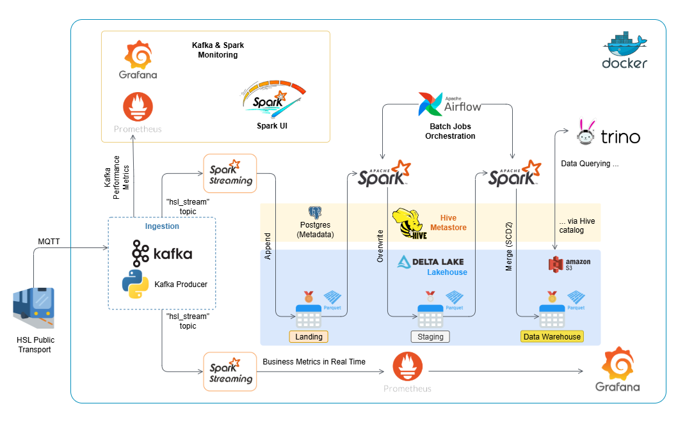

# HSL Transport Streaming Lakehouse

👉 [Jump straight to the Architecture Diagram](#architecture-and-workflow)

## Overview

HSL (Helsingin seudun liikenne) is the Helsinki Regional Transport Authority, responsible for planning and operating public transport across the capital region of Finland (Helsinki, Espoo, Vantaa, and surrounding municipalities).

It provides open data via MQTT and GTFS feeds with real-time events like vehicle positions, trip progress, and stop arrivals.
Buses, trams, metro, trains, and ferries emit these messages continuously, creating a fast-changing transport data stream.

This makes it a perfect use case for streaming pipelines, supporting both real-time monitoring and historical analysis.

And to achieve this, I built a **streaming Lakehouse** with:

* Kafka for ingestion
* Spark Structured Streaming for processing
* Delta Lake + Hive Metastore for storage (raw → staging → DW)
* Airflow for batch orchestration
* Trino for SQL queries
* Prometheus + Grafana for monitoring and dashboards

This project puts its main focus on Apache Spark and Delta Lakehouse. These technologies are also the core building blocks of the Databricks platform, and working with them directly helped me prepare for and pass the [**Databricks Data Engineer Associate exam**](https://www.databricks.com/learn/certification/data-engineer-associate).

---

## Business Value

This automated transport pipeline delivers clear value:

* **Operational visibility in real time:** operators can instantly monitor vehicle activity and delays, enabling faster responses to incidents and service disruptions.
* **Capacity and demand planning:** integrating real-time with historical data supports forecasting passenger loads, optimizing schedules, and balancing fleet capacity.
* **Bottleneck detection:** continuous monitoring reveals recurring delays, overloaded stops, and underperforming routes, guiding targeted infrastructure or scheduling improvements.
* **Innovation and future use cases:** the GTFS-based model lays the foundation for advanced analytics and ML, such as predictive maintenance, demand forecasting, and route optimization.

---

## Stack and Technologies

This project uses the following technologies and services:

* Apache Spark (Structured Streaming, batch jobs)
* Delta Lake (transactional data lakehouse format)
* Apache Kafka with ZooKeeper (real-time ingestion)
* Hive Metastore with PostgreSQL (metadata and catalog)
* Apache Airflow (batch orchestration, SCD2 merges)
* Trino (SQL queries over Delta tables)
* Prometheus (metrics scraping)
* Grafana (real-time dashboards)
* Docker Compose (containerized local environment)
* Python (data quality checks, producer, utilities)

---

## Architecture and Workflow



The pipeline begins with **HSL Public Transport**, which publishes real-time vehicle data (positions, trip updates, delays) via MQTT. A custom **Python Kafka Producer** ingests these messages and pushes them into the `hsl_stream` Kafka topic.

From there, the data flows into multiple layers following the **Medallion Lakehouse architecture**:

* **Bronze (Landing) – raw data ingestion:**
  Spark Structured Streaming consumes Kafka events and appends them to the **Delta Lake landing layer**. At this stage, the data is raw and unprocessed, serving as a reliable source of truth. In parallel, another Spark job computes **real-time business metrics** (active vehicles, average speed, on-time ratio) and exposes them to **Prometheus**, with live dashboards in **Grafana**.

* **Silver (Staging) – cleaned and normalized data:**
  Batch jobs orchestrated by **Apache Airflow** overwrite the staging tables with cleaned, normalized data.

* **Gold (Data Warehouse) – curated analytics layer:**
  Additional Spark jobs perform **SCD2 merges** into the **Delta Lake DW layer**.

* **Storage and metadata (Delta Lake + Hive Metastore):**
  All three layers (Bronze, Silver, Gold) are managed in **Delta Lake**, which provides ACID transactions, schema evolution, and time travel. The **Hive Metastore** (with PostgreSQL backend) maintains metadata, enabling query engines to access the tables.

* **Query and analytics (Trino):**
  Analysts can query any layer (Bronze, Silver, or Gold) via **Trino**, which integrates with the Hive Metastore.

* **Monitoring and observability (Prometheus + Grafana):**
  Kafka broker metrics (via JMX exporter) and custom Spark streaming metrics are collected by **Prometheus** and visualized in **Grafana**. This provides end-to-end visibility into ingestion, processing, and transport KPIs.

All services run in **Docker Compose**, making the setup reproducible locally while still following modern Lakehouse design principles.

---

## Data Model and Warehouse

In the **Gold layer (Data Warehouse)** three main tables are created:

* **dim\_routes**

  * route\_id, agency\_id, short/long name, route type
  * SCD2 fields: effective\_start\_dt, effective\_end\_dt, active\_flg, row\_wid

* **dim\_stops**

  * stop\_id, stop\_name, coordinates (lat, lon), zone, parent station, platform, vehicle\_type
  * SCD2 fields: effective\_start\_dt, effective\_end\_dt, active\_flg, row\_wid

* **fact\_vehicle\_position**

  * event-level data: date (oday), timestamp, route\_id, stop, vehicle\_number, operator, transport mode, direction, headsign, lat/long, speed, delay, occupancy, event\_type
  * partitioned by operational day (`oday`) for performance

All tables include **audit fields** (insert\_time, update\_time, rundate).

Together, these form a small **star schema**:

* **2 dimensions (routes, stops)**
* **1 fact (vehicle events)**

This allows analytical queries such as:

* On-time performance per route
* Average speed by route and vehicle
* Vehicle usage and occupancy trends over time

If you want to know more about the underlying data definitions, see the official **GTFS documentation**:

* [GTFS Overview](https://gtfs.org/documentation/overview/)
* [Extended route types](https://developers.google.com/transit/gtfs/reference/extended-route-types)

---

## How to run - Recommended Order

⚠️ **Note**: This project was originally designed for a single machine. Running all services at once with
`docker compose up` may overload your system. Instead, it’s better to start services gradually.

### 0. Configure AWS credentials & S3 bucket

1. **Create an S3 bucket** (must be globally unique). Example:

   ```bash
   aws s3 mb s3://my-hsl-lakehouse-bucket
   ```

   Replace `my-hsl-lakehouse-bucket` with your own unique name.

2. **Add AWS credentials** to `./aws/credentials` and `./aws/config`:

   ```
   [default]
   aws_access_key_id=YOUR_KEY
   aws_secret_access_key=YOUR_SECRET
   region=eu-north-1
   ```

3. **Update Spark configuration** (`spark/Dockerfile`) – set the default bucket name:

   ```dockerfile
   ENV S3_BUCKET=my-hsl-lakehouse-bucket
   ```

4. **Update Hive Metastore configuration** (`hive-metastore/hive-site.xml`) – point to the same S3 bucket:

   ```xml
    <property>
      <name>hive.metastore.warehouse.dir</name>
      <value>s3a://my-hsl-lakehouse-bucket/warehouse</value>
    </property>
   ```

This ensures Spark, Hive Metastore, and downstream jobs all write to the same S3 bucket.

---

### 1. Start Spark cluster

```bash
docker compose up -d spark-master spark-worker
```

* Spark Master UI → [http://localhost:8081](http://localhost:8081)

---

### 2. Start core services

```bash
docker compose up -d zookeeper kafka grafana prometheus postgres hive-metastore dbeaver trino pgadmin airflow-webserver airflow-scheduler airflow-init
```

* Kafka → `localhost:9092`
* Prometheus → [http://localhost:9090](http://localhost:9090)
* Grafana → [http://localhost:3000](http://localhost:3000) (user: `admin`, pass: `admin`)
* Airflow → [http://localhost:8080](http://localhost:8080) (user: `airflow`, pass: `airflow`)
* Trino (via CloudBeaver) → [http://localhost:8978](http://localhost:8978)
* PostgreSQL (via pgAdmin) → [http://localhost:5050](http://localhost:5050)

`airflow-webserver` may be needed to re-run

---

### 3. Initialize Delta databases

Run short Spark job once (no need to repeat):

```bash
docker compose up spark-db-init
```

* Creates the required Delta databases (hdw_ld, hdw_stg, hdw)
* Initializes control tables (used by batch ETL jobs and Airflow DAGs)
* Ensures the S3 warehouse folder structure exists

---

### 4. Start real-time ingestion

```bash
docker compose up -d hsl-transport-service
```

* Produces HSL events via MQTT → Kafka collects them into `hsl_stream` topic.
* Monitor Kafka with Grafana dashboards.
* You can also increase the velocity of events by decreasing the `TIME_SLEEP` parameter in [HSL producer script](/hsl-transport-service/hsl_producer.py)

---

### 5. Process landing layer

Run Spark streaming job to collect some data, then stop:

```bash
docker compose up hsl-spark-streaming-landing
```

* Consumes Kafka events.
* Stores them into **Delta Lake (Bronze)**.

---

### 6. Run real-time metrics

```bash
docker compose up hsl-spark-streaming-metrics
```

* Pushes metrics to **Prometheus**.
* View live dashboards in **Grafana**.
* Stop `hsl-spark-streaming-metrics` when done.

---

### 7. Batch processing (ETL)

* Open **Airflow** → trigger DAGs to move data Bronze → Silver → Gold.

---

### 8. Explore the Data Warehouse

* Open **CloudBeaver** → connect to **Trino** → query `hdw.gold_*` tables.
* Explore PostgreSQL metadata in **pgAdmin**.

---

## Feedback

I'm always happy to hear any feedback, suggestions, or ideas on how this project can be further improved.

Feel free to open an issue or contact me on [LinkedIn](https://www.linkedin.com/in/oleg-ivantsov/).

---

## License

This project is released under the MIT License.
